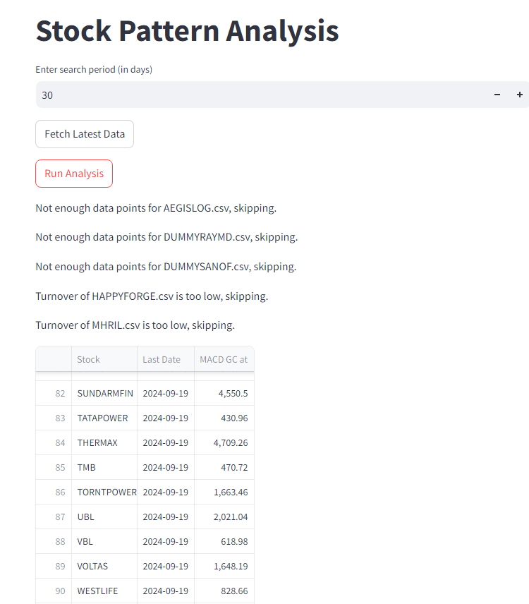

```markdown
# Stock Pattern Analysis with Streamlit

This project provides a Streamlit-based web application to analyze stock patterns. Users can fetch the latest stock data using the `yfinance` API and perform technical analysis, including detecting EMA and MACD patterns. The app allows dynamic interaction through user inputs for search periods and displays results in a tabular format.

## Features

- **Fetch Latest Stock Data**: Download the latest stock data for Nifty 500 companies using the `yfinance` API with a single click.
- **Pattern Analysis**: Analyze stocks for EMA (Exponential Moving Average) and MACD (Moving Average Convergence Divergence) golden crosses over customizable time periods.
- **User Input Options**: Choose search period and specify the data directory path.
- **Real-time Analysis**: Display results in a tabular format on the web interface for quick interpretation.
- **Turnover and Volume Checks**: Stocks with insufficient turnover or volume are automatically filtered out.

## Requirements

Before running the application, make sure you have the following installed:

- Python 3.7+
- `streamlit`
- `yfinance`
- `pandas`
- `datetime`

You can install the required packages using the following command:

```bash
pip install streamlit yfinance pandas
```

## Sample



## Setup

1. Clone this repository:

```bash
git clone https://github.com/yourusername/stock-pattern-analysis.git
cd stock-pattern-analysis
```

2. Ensure you have a CSV file named `nifty500.csv` in the project directory, with the following format:

```
Company Name,Symbol
Reliance Industries Ltd,RELIANCE
Tata Consultancy Services Ltd,TCS
Infosys Ltd,INFY
...
```

3. Create a directory called `data` in the project root:

```bash
mkdir data
```

This is where the downloaded stock data will be saved.

## How to Run

1. Run the Streamlit app:

```bash
streamlit run app.py
```

2. The app should open in your browser. If not, navigate to the URL printed in your terminal (e.g., `http://localhost:8501`).

### Fetching Latest Data

1. Once the app is running, click the **Fetch Latest Data** button to download the latest stock data for Nifty 500 companies.
2. The data will be saved in the `data` directory in CSV format.

### Running Stock Analysis

1. Input the **search period** in days using the slider or number input box.
2. Click the **Run Analysis** button to analyze the stock data.
3. The results will be displayed in a table, showing stocks that match the specified EMA and MACD criteria.

## File Structure

```plaintext
.
├── data/                   # Folder where stock data is saved (CSV files)
├── nifty500.csv            # List of stock symbols (input file)
├── app.py                  # Main Streamlit application
├── README.md               # Project documentation
└── requirements.txt        # Dependencies
```

## Explanation of Key Functions

- `snapshot()`: Fetches the latest stock data from `yfinance` and saves it in CSV format.
- `process_stocks()`: Analyzes the stock data for patterns, such as EMA and MACD golden crosses.
- `cross()` and `cross_within_period()`: Check if two parameters (e.g., moving averages) cross at a specific point or within a specified period.
- `find_amount()`: Calculates the turnover of a stock using its closing price and volume.
  
## Customization

- **Search Period**: You can customize the search period for pattern analysis directly from the app interface.
- **Data Directory**: The app allows you to specify the directory where stock data is stored or downloaded.

## License

This project is licensed under the MIT License.

## Acknowledgements

- **Streamlit**: An open-source framework for building data-driven applications.
- **Yahoo Finance API (`yfinance`)**: Used for downloading the latest stock data.
```